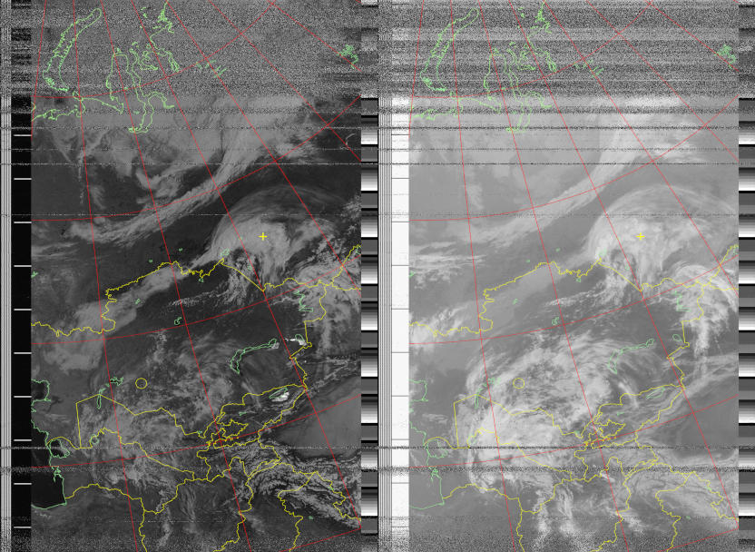

# Sats Receiver
[][pypi_proj]
[][pypi_proj]
[][license]  
[][tests]
[][codecov]
[][upload]

[pypi_proj]: https://pypi.org/project/sats-receiver/
[license]: https://github.com/baskiton/sats-receiver/blob/main/LICENSE
[tests]: https://github.com/baskiton/sats-receiver/actions/workflows/tests.yml
[codecov]: https://app.codecov.io/gh/baskiton/sats-receiver
[upload]: https://github.com/baskiton/sats-receiver/actions/workflows/pypi-upload.yml

Satellites data receiver based on GNURadio

<!-- TOC -->
* [About](#About)
* [Requirements](#Requirements)
* [Installation](#Installation)
  * [From source](#From-source)
  * [From PYPI](#From-PYPI)
* [Usage](#Usage)
* [Configure](#Configure)
  * [observer](#observer)
  * [tle](#tle)
  * [receivers](#receivers)
    * [sats](#sats)
      * [frequencies](#frequencies)
        * [modulations](#modulations)
        * [decoders](#decoders)
          * [gr-satellites](#gr-satellites)
* [Map Shapes](#Map-Shapes)
  * [shapes](#shapes)
  * [points](#points)
<!-- TOC -->


### About
This program is written to automate the process of receiving signals from
various orbiting satellites on your SDR. The basis for digital signal
processing is GNU Radio - a free software development toolkit that provides
signal processing blocks to implement software-defined radios and
signal-processing systems. [[wikipedia](https://en.wikipedia.org/wiki/GNU_Radio)]  
For example, this program is perfect for receiving weather
satellites like NOAA (image below).  
If you have ideas or knowledge on how to improve this project, feel free to submit issues or pull requests.




### Requirements
The program has only been tested on Linux. Work on Windows is not guaranteed!
* Python>=3.10 (or lower, see below)
* GNURadio>=3.10 (or lower if gr-soapy installed); GUI-modules is not required
* librtlsdr (if you use RTL-SDR)

### Installation
I recommended to use miniconda. So, first of all,
[install it.](https://docs.conda.io/en/latest/miniconda.html#linux-installers)

#### From source
```commandline
cd sats-receiver
conda create -n sats-receiver-env python
conda activate sats-receiver-env
conda config --env --add channels conda-forge
conda config --env --set channel_priority strict
conda env update -f environment.yml
pip install -r requirements.txt
```

#### From PYPI
```commandline
conda create -n sats-receiver-env python
conda activate sats-receiver-env
conda config --env --add channels conda-forge
conda config --env --set channel_priority strict
conda install gnuradio gnuradio-satellites
pip install sats-receiver
```

### Usage
First, activate conda environment:  
`conda activate sats-receiver-env`

`python -u -m sats_receiver [-h, --help] [--log LOG] [--sysu SYSU] config`  
* `config` Config file path. See [Configure](#Configure)
* `-h, --help` Help message
* `--log LOG` Logging level, INFO default
* `--sysu SYSU` System Usages debug info timeout in seconds, 1 hour default

For example, simple command line to launch program:  
`python -u -m sats_receiver /path/to/config.json`  
You can copy the `default.json` config file from the root of the repository to a
location of your choice

Program home directory is `~/sats_receiver`  
Logfile saved to program home directory (`~/sats_receiver/logs`)  
Tle files stored to program home directory (`~/sats_receiver/tle`)  

### Configure
The configuration file is in JSON format.  
You can copy the `default.json` file from the root of the repository to a
location of your choice and edit it.

| Field     | Type            | Description                                                |
|:----------|:----------------|:-----------------------------------------------------------|
| observer  | Object          | Observer/receiver parameters (see [observer](#observer))   |
| tle       | Object          | TLE data parameters (see [tle](#tle))                      |
| receivers | Array of Object | List of receivers parameters (see [receivers](#receivers)) |


#### observer

| Field     | Type           | Description                                                                                                         |
|:----------|:---------------|:--------------------------------------------------------------------------------------------------------------------|
| latitude  | Number         | Receiver Latitude, degrees                                                                                          |
| longitude | Number         | Receiver Longitude, degrees                                                                                         |
| elevation | Number or null | Receiver Elevation, meters. `null` means that the height will be obtained from the weather information or set to 0  |
| weather   | Boolean        | Whether to receive weather information from the Internet. The weather will be taken from the service open-meteo.com |


#### tle

| Field         | Type   | Description               |
|:--------------|:-------|:--------------------------|
| url           | String | URL to TLE file           |
| update_period | Number | TLE Update period, hours. |


#### receivers
Each receiver object contain:

| Field            | Type            | Description                                                                                                                                                                        |
|:-----------------|:----------------|:-----------------------------------------------------------------------------------------------------------------------------------------------------------------------------------|
| name             | String          | Name of the Receiver                                                                                                                                                               |
| source           | String          | String value for gr-soapy driver key, e.g. `rtlsdr`, `lime`, `uhd`, `remote`                                                                                                       |
| tune             | Number          | Receiver tune frequency, Hz                                                                                                                                                        |
| samp_rate        | Number          | Receiver sample rate, Hz                                                                                                                                                           |
| output_directory | String          | Directory to save received files. You also might specify `~` symbol to specify User home directory                                                                                 |
| sats             | Array of Object | List of Satellites configurations (see [sats](#sats))                                                                                                                              |
| enabled          | Boolean         | _Optional._ Enable or Disable this Receiver. `true` by default                                                                                                                     |
| serial           | String          | _Optional._ Serial number of the receiver. Empty by default                                                                                                                        |
| biast            | Boolean         | _Optional._ Bias-T enable/disable (only for RTL-SDR at this time). `false` by default. **WARNING! Be careful when enabling this option! Use only if you know what it is and why!** |
| gain             | Boolean         | _Optional._ Receiver gain, dB. `0` by default                                                                                                                                      |


#### sats
Each satellite object contain:

| Field         | Type            | Description                                                                                                |
|:--------------|:----------------|:-----------------------------------------------------------------------------------------------------------|
| name          | String          | Name or NORAD number of the satellite. Note: name/norad-number must be contained in the above TLE file     |
| frequencies   | Array of Object | List of frequency configuration (see [frequencies](#frequencies))                                          |
| enabled       | Boolean         | _Optional._ Enable/Disable this frequency. `true` by default                                               |
| min_elevation | Number          | _Optional._ Elevation angle above the horizon, degrees. `0` by default. Negative number is equivalent to 0 |
| doppler       | Boolean         | _Optional._ Enable/Disable doppler correction. `true` by default                                           |


#### frequencies
Each frequency object contain:

| Field           | Type            | Description                                                                                                            |
|:----------------|:----------------|:-----------------------------------------------------------------------------------------------------------------------|
| freq            | Number          | Basic signal frequency, Hz                                                                                             |
| bandwidth       | Number          | Received signal bandwidth, Hz                                                                                          |
| enabled         | Boolean         | _Optional._ Enable/Disable this frequency. `true` by default                                                           |
| freq_correction | Boolean         | _Optional._ Correction for basic frequency, Hz. `0` by default                                                         |
| mode            | String          | _Optional._ Modulation option (see [modulations](#modulations)). `RAW` by default                                      |
| decode          | String          | _Optional._ Decoder option (see [decoders](#decoders)). `RAW` by default                                               |
| channels        | Array of Number | _Required only for **GMSK** mode._ Demodulation baudrates, bps                                                         |
| rstream_bits    | Boolean         | _Optional. Only for **RSTREAM** decoder._ Store data as 0-1 stream. Recommended for digital signals `false` by default |
| grs_file        | String          | _Optional. Only for **SATS** decoder._ See [gr-satellites](#gr-satellites) for details                                 |
| grs_name        | String          | _Optional. Only for **SATS** decoder._ See [gr-satellites](#gr-satellites) for details                                 |
| grs_norad       | String          | _Optional. Only for **SATS** decoder._ See [gr-satellites](#gr-satellites) for details                                 |
| grs_tlm_decode  | Boolean         | _Optional. Only for **SATS** decoder._ Save decoded telemetry. `true` by default                                       |
| qpsk_baudrate   | Number          | _Required only for **QPSK** mode._ QPSK Baudrate, bps                                                                  |
| qpsk_excess_bw  | Number          | _Optional. Only for **QPSK** mode._ QPSK Excess bandwidth. `0.35` by default                                           |
| qpsk_ntaps      | Integer         | _Optional. Only for **QPSK** mode._ QPSK number of taps. `33` by default                                               |
| qpsk_costas_bw  | Number          | _Optional. Only for **QPSK** mode._ QPSK Costas bandwidth. `0.005` by default                                          |
| sstv_wsr        | Number          | _Optional. Only for **SSTV** decoder._ SSTV work samplerate. `16000` by default                                        |
| sstv_sync       | Number          | _Optional. Only for **SSTV** decoder._ SSTV syncing. `true` by default                                                 |


#### modulations
* `RAW`
* `AM`
* `FM`
* `WFM`
* `WFM_STEREO`
* `QUAD`
* `QPSK`
* `GMSK`

#### decoders
* `RAW` Saved to 2-channel float32 WAV file with `bandwidth` sample rate
* `RSTREAM` Raw Stream - 1-channel binary int8. Suitable for further processing, for example, in SatDump
* `APT` Sats-Receiver APT binary file format. See [APT](sats_receiver/systems/README.md#APT)
* `SSTV` SSTV saved to PNG image with EXIF. Supported modes:
  * Robot (24, 24, 72)
  * Martin (M1, M2, M3, M4)
  * PD (50, 90, 120, 160, 180, 240, 290)
  * Scottie (S1, S2, S3, S4)
* `SATS` See [gr-satellites](#gr-satellites) for details
* ~~`LRPT`~~ Not implemented yet

##### gr-satellites
See [gr-satellites Documentation][grs-doc]  
**IMPORTANT:** For this decoder need to leave the `modulation` on `RAW`  

This decoder need to specify one of the parameters for recognize satellite option:
* grs_file - Path to your own [SatYAML-file][grs-satyaml]
* grs_name - Satellite name (may different from [sats name](#sats))
* grs_norad - Satellite NORAD ID

[List of builtin supported satellites][grs-satlist]  
Additionally supported satellites can be found in the [satyaml](satyaml) directory of this repository

[grs-doc]: https://gr-satellites.readthedocs.io/en/latest/
[grs-satyaml]: https://gr-satellites.readthedocs.io/en/latest/satyaml.html
[grs-satlist]: https://gr-satellites.readthedocs.io/en/latest/supported_satellites.html


### Map Shapes
Map shapes config file `map_shapes.json` can be found at the root of this repository.
Shapefiles can be downloaded from [Natural Earth](https://www.naturalearthdata.com/downloads/)

| Field      | Type             | Description                                                                        |
|:-----------|:-----------------|:-----------------------------------------------------------------------------------|
| shapes     | Array of Array   | _Optional._ List of shapes data (see [shapes](#shapes))                            |
| shapes_dir | String           | _Optional. Only when `shapes` specified._ Path to directory contains shapes file   |
| points     | Object of Object | _Optional._ Additional points to draw on map (see [points](#points))               |
| line_width | Number           | _Optional._ Overlay lines width, pixels. `1` by default                            |


#### shapes
Each shape contain:

| Offset | Field     | Type                       | Description                                                                                                        |
|:-------|:----------|:---------------------------|:-------------------------------------------------------------------------------------------------------------------|
| 0      | order     | Number                     | Num in order of drawing. The more, the later it will be drawn.                                                     |
| 1      | shapefile | String                     | Filename of shapefile in shapes dir. Can be separates file or ZIP archive                                          |
| 2      | color     | String or Array of Integer | Color. Can be string representing (`red` e.g.), web hex (`#abcdef` e.g.) or 3-4-Array 0-255 (`[0, 127, 255]` e.g.) |

#### points
Each point object has name.  
If name is `observer`, then lonlat field is filled with lonlat from apt-file.  
Each point object contain:

| Field  | Type                        | Description                                                                                                                    |
|:-------|:----------------------------|:-------------------------------------------------------------------------------------------------------------------------------|
| color  | String or Array of Integer  | Color. Can be string representing (`red` e.g.), web hex (`#abcdef` e.g.) or 3-4-Array 0-255 (`[0, 127, 255]` e.g.)             |
| type   | String                      | Type of marker view. Can be `+`, `o`                                                                                           |
| size   | Integer or Array of Integer | If `type` is `+` then Array with line width and line length, pixels. If `type` is `o` then Integer as radius of circle, pixels |
| lonlat | Array of Number             | _Optional. **Only for non-observer name.**_ 2-Array of point longitude and latitude, degrees                                   |
| order  | Number                      | _Optional._ Same as in `shapes`. Default to last                                                                               |
